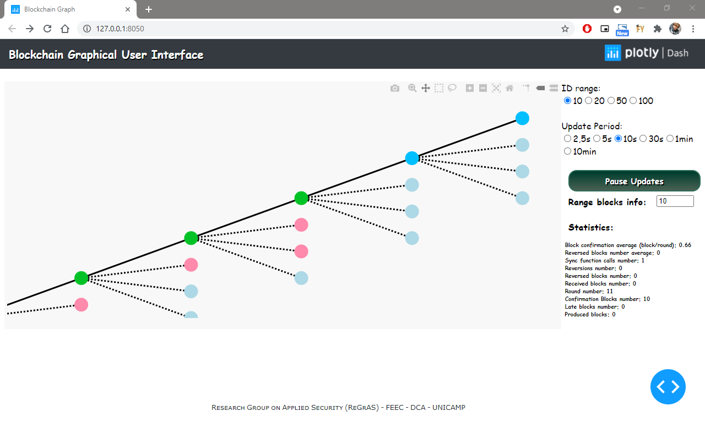

# Blockchain Graphical User Interface

Blockchain Graphical User Interface is a Python tool for monitoring the dynamic evolution of a single node blockchain on the network under the control of a consensus mechanism. For practical development, the application has been integrated with the [Probabilistic Proof-of-Stake (PPoS)](https://github.com/regras/bc_pos) protocol.



---
## Getting Started

These instructions will get you a copy of the project up and running on your local machine for development and testing purposes. See deployment for notes on how to deploy the project on a live system.


### Prerequisites

What you need to install to run the software and how to install it on Linux Ubuntu

#### Requested Python Libraries:

- **Networkx**
```
pip install networkx
```
- **Graphviz**
```
pip install graphviz
```
- **Plotly**
```
pip install plotly
```
- **Dash**
```
pip install dash==1.16.0
```
- **SQLite3**
```
apt-get install sqlite3
```


### How to Use

Before running the application, you need the consensus mechanism [PPoS](https://github.com/regras/bc_pos/tree/pos_graphic_interface), into which the application has been integrated. This link represents the testbed to evaluate PPoS consensus blockchain.

After having access to the project, it is necessary to define the location of the blockchain database in the variable "databaseLocation" in the blockchain_list() function of the "interface.py" file. The blockchain data is a file named "blockchain.db" which is found in the "blocks" folder of the protocol PPoS.

After defining the variable "databaseLocation", the application can be started and executed together with the consensus protocol.

To start the application, open the Linux terminal and type:

```
python3 interface.py
```

The dash server will be running and to access the application just access:

```
http://127.0.0.1:8050/
```
Upon opening the link, a preview of the blockchain will be shown allowing interactions with the mouse cursor. In the current state of the tool, the blockchain will be updated every 10 seconds, that is, if there is any creation or deletion of blocks from the blockchain the application will update the blockchain visualization every 10 seconds.

---
## Deployment

This section presents some additional notes on how to deploy this to another active system. 

To implement the application in the consensus engine, it is necessary to define the location of the blockchain database in the variable "databaseLocation" in the blockchain_list() function of the "interface.py" file. This function is responsible for reading the information from the database returning a list where each element is a block of the blockchain. To reuse this application in another consensus mechanism, some modifications are needed in the way data is collected in each protocol by the blockchain_list() function. Extracting the relevant information from the cited function of the protocol, it may be necessary to adjust how the Blockchain_Graph() function of the "interface.py" file will work with this data. 

It is important to emphasize that the tool is still under development and will still undergo several improvements.

---
## Built With

* [Networkx](https://networkx.github.io/documentation/stable/index.html) - Networkx User Guide
* [Plotly](https://plotly.com/python/) - Plotly Python Open Source Graphing Library
* [Dash and Plotly](https://dash.plotly.com/) - Dash User Guide (with Plotly)
* [Plotly and Networkx](https://plotly.com/python/network-graphs/) - Networkx Graphs in Python with Plotly


---
## Authors

* **Bryan Wolff** - bryan.wolff@hotmail.com
* **Diego Fernandes Gonçalves Martins**
* **Marco Aurelio Amaral Henriques**

See also the list of [contributors](https://github.com/regras/bcgui/graphs/contributors) who participated in this project.
